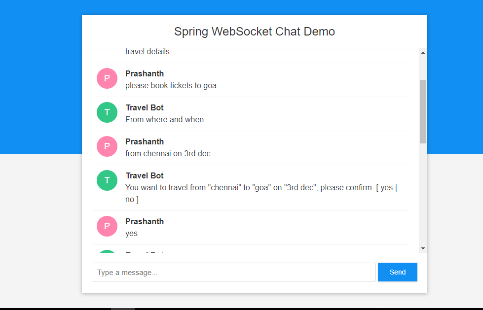

## Spring Boot WebSocket Chat Appplication

You can checkout the live version of the application at https://spring-ws-chat.herokuapp.com/



## Requirements

1. Java - 1.8.x

2. Maven - 3.x.x

## Steps to Setup

**1. Clone the application**

```bash
git clone https://github.com/mekaprashanth/chatbot-opennlp-spring-websocket.git
```
